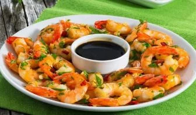
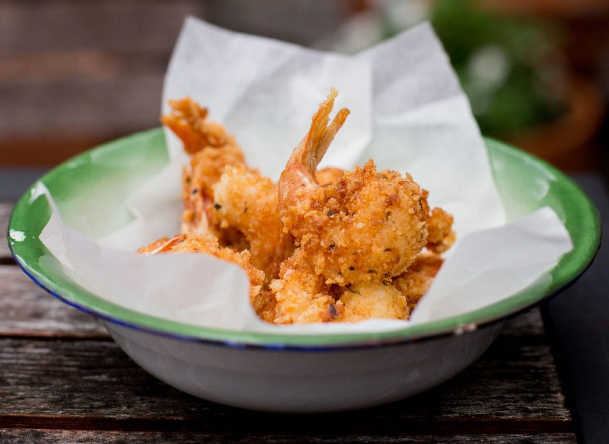
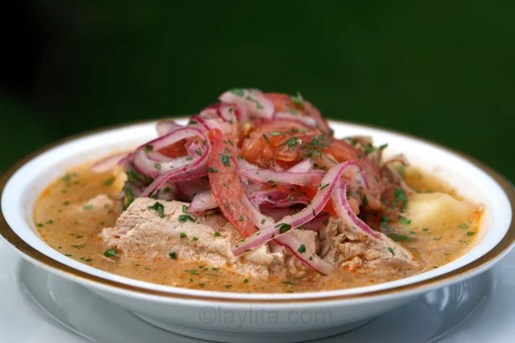
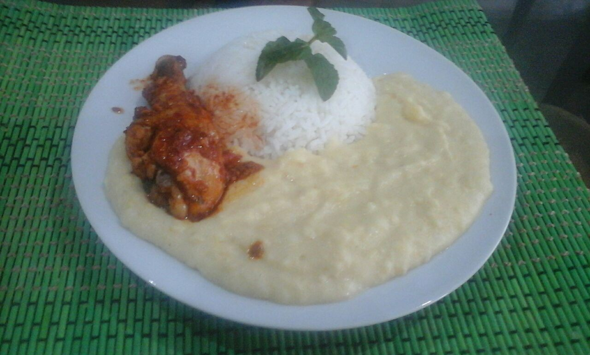
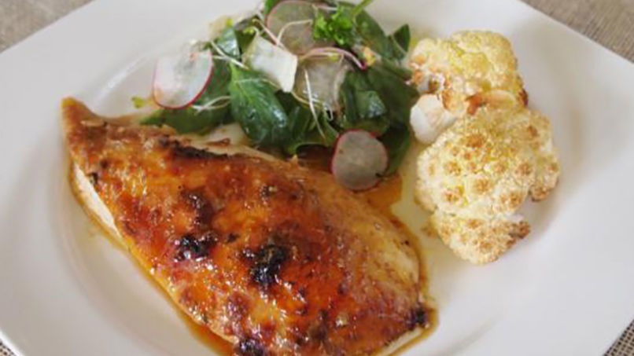
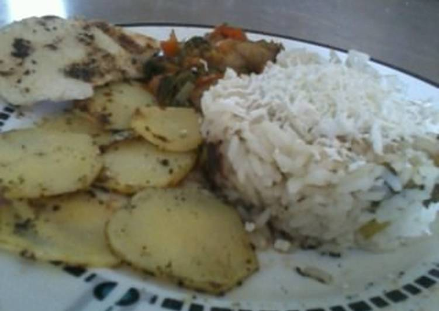
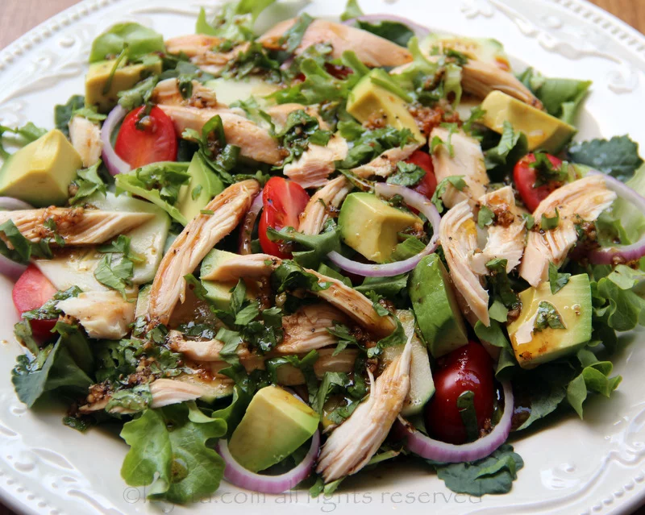
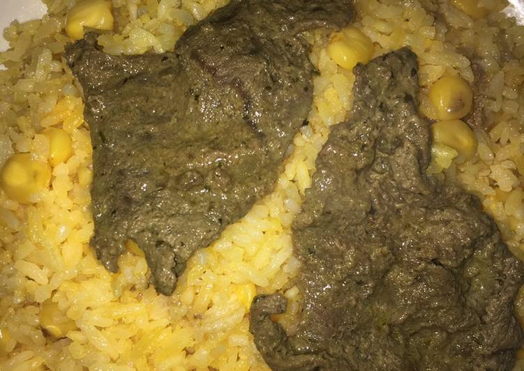
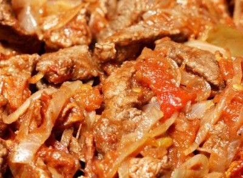

<html>
<head>
<title>
Menu de restaurant.
</title>
</head
<body bgcolor="d6d7c6">

<h1><i><b>Marisqueria doña maria</b></i></h1>

Variedades de mariscos el cual desee escojer a su gusto:

<table>
  <tr>
        <td>

        </td>
        <td>
            <h3><i><b>1. Camarones en salsa de naranja y miel</b><i></h3>

            Los camarones son unos mariscos exquisitos, muy fáciles de preparar y además muy saludables, son bajos en calorías, ricos en proteínas y minerales, por lo que son un excelente aliado si quieres bajar de peso y mantenerte saludable, por eso te compartimos esta receta de Camarones en Salsa de Naranja y Miel, una opción muy deliciosa y rápida para cualquier ocasión.
        </td>
  </tr>
<tr>
        <td>

        </td>
        <td>
            <h3><i><b>2. camarones apanados</b><i></h3>

            Ingredientes: 
1 taza de harina
1 huevo
1/2 taza de leche
2 tazas de migas de pan añejo o pan rallado
1/2 cucharadita de albahaca seca
1/2 cucharadita de perejil seco
1/2 cucharadita de sal
24-28 camarones limpios crudos
Aceite para freír
        </td>
  </tr>
<tr>
        <td>

        </td>
        <td>
            <h3><i><b>3. encebollado</b><i></h3>

           Ingredientes: 
2 libras de atún fresco
1 libra de yuca fresca o congelada
2 cucharadas de aceite
2 tomates picados
½ cebolla picada
1 cucharadita de aji no picante en polvo se puede usar pimentón molido
2 cucharaditas de comino molido
8 tazas de agua
5 ramitas de cilantro o culantro
Sal al gusto
        </td>
  </tr>
<tr>
        <td>

        </td>
        <td>
            <h3><i><b>4. arroz con pure de papa  y pollo</b><i></h3>

            Ingredientes para el puré de papa: 
½ kilo de papa amarilla
3 cucharadas de mantequilla
Un tarro pequeño de leche evaporada
Media taza de agua hervida
Un poco de sal
Un poco de agua

        </td>
  </tr>
<tr>
        <td>

        </td>
        <td>
            <h3><i><b>5. Pollo hornado</b><i></h3>

            Ingredientes: 
1
pollo entero
1/2
taza de sal
1
cucharadita de pimienta
1/2
taza de azúcar
1
limón
2
cucharadas de miel
1
cucharada de mostaza
2
cucharadas de salsa de soya
1
cucharada de aceite de oliva
1
ramita de tomillo fresco
4
dientes de ajo, enteros
        </td>
  </tr>
<tr>
        <td>

        </td>
        <td>
            <h3><i><b>6. Papas con pollo y arroz</b><i></h3>

            Ingredientes: 	
1 taza harina de maíz
1 papa
2 tazas agua
1 taza arroz
2 tomates
1/2 cebolla
1 pimentón rojo
1 pimentón verde
1/4 taza aceite de oliva
queso blanco rallado
1/2 taza caldo de pollo
1 bandeja pollo
        </td>
  </tr>
<tr>
        <td>

        </td>
        <td>
            <h3><i><b>7. ensalada de verduras con pollo</b><i></h3>

            Ingredientes: 

Para el aderezo de vinagre balsámico con cilantro:

1-2 cucharadas de vinagre balsámico, ajuste a su gusto
2-3 cucharadas de aceite de oliva, ajuste al gusto
1 diente de ajo, triturado
1 cucharada de cilantro picado (también puede usar perejil o albahaca según su gusto y lo que tiene)
Sal y pimienta al gusto
        </td>
  </tr>
<tr>
        <td>

        </td>
        <td>
            <h3><i><b>8. carne frita arros con choclo</b><i></h3>

            Ingredientes: 	
Arroz
Choclo
Mantequilla
Carne
Achiote
Ranchero (caldo instantáneo de pollo)
        </td>
  </tr>
<tr>
        <td>

        </td>
        <td>
            <h3><i><b>9. bitec de carne</b><i></h3>

           Ingredientes: 
Filetes de carne de res 4
Tomate picado en juliana ½
Cebolla picada en juliana ½
Pimiento picado en juliana ½
Aliño de ajo 1 cucharada
Sal al gusto
Achiote 1 cucharada
        </td>
  </tr>
<tr>
</table>

</body>
</html>
